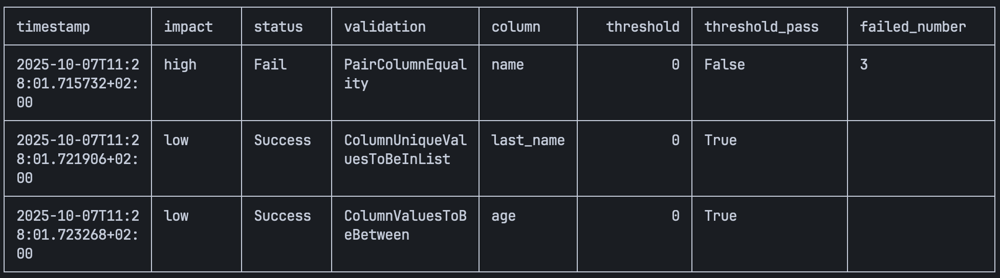
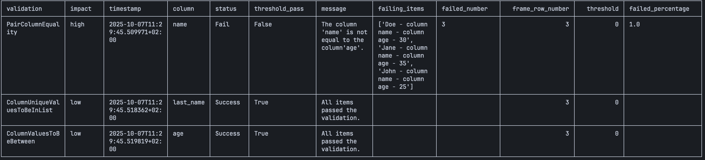
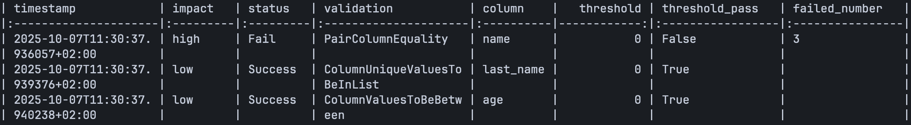

<h1 align="center">
    
    <p style="font-size: 16px; font-weight: bold;">Una biblioteca de validación de datos simple y fácil de usar para Python.</p>
    
</h1>

<p align="center">
  <a href="https://badge.fury.io/py/Validoopsie">
    
  </a>
  <a href="https://pepy.tech/projects/validoopsie">
    
  </a>
  <a href="https://github.com/akmalsoliev/Validoopsie/actions/workflows/tests.yaml">
    
  </a>
  <a href="https://github.com/akmalsoliev/Validoopsie/actions/workflows/docs.yaml">
    
  </a>
</p>

# Validoopsie

Validoopsie es una biblioteca de validación de datos para Python notablemente ligera y fácil de usar. Está diseñada para ayudarte a declarar clases fácilmente y encadenar validaciones entre sí, con un estilo que recuerda a las populares bibliotecas de DataFrames. Esto la convierte en una herramienta familiar e intuitiva para los desarrolladores que trabajan regularmente con dataframes.

Gracias al excelente trabajo de [Narwhals](https://github.com/narwhals-dev/narwhals), Validoopsie incorpora el concepto de "Trae tu propio DataFrame" (BYOD). Esta flexibilidad te permite usar cualquier DataFrame compatible con Narwhals para tus tareas de validación de datos. Para explorar toda la gama de DataFrames compatibles, puedes visitar [este enlace](https://narwhals-dev.github.io/narwhals/extending/).

La sintaxis de Validoopsie ha sido cuidadosamente diseñada para garantizar una fácil utilización. Cada función de validación está encapsulada en su propio método, el cual puede enlazarse sin problemas con otros. Este diseño específico por método prioriza la simplicidad y la legibilidad, liberándote de la necesidad de adaptarte a una nueva API cada vez que cambies de biblioteca. Te permite centrarte en mantener un código limpio y comprensible.

Validoopsie se inspira significativamente en la biblioteca Great Expectations. Se esfuerza por simplificar el proceso de validación de datos, haciéndolo directo y eficiente. Ya sea que estés verificando la integridad de los datos o asegurando el cumplimiento de estándares de datos, Validoopsie ofrece una solución optimizada pero potente para hacer que estas tareas sean accesibles y sencillas.

## Table of Contents

1. [Instalación](#installation)
2. [Primeros pasos](#getting-started)
3. [Versión](#version)
4. [Métodos Dunder](#dunder-methods)
5. [Método Validate](#validate-method)
6. [Desarrollo](#development)
7. [Licencia](#license)

## Installation

- pip

  `pip install Validoopsie`

- uv

  `uv add Validoopsie`

## Getting Started

- [📖 Documentación](https://akmalsoliev.github.io/Validoopsie/)
- [🚨 Niveles de impacto en Validoopsie](https://akmalsoliev.github.io/Validoopsie/impact_levels.html)
- [🎯 Niveles de umbral en Validoopsie](https://akmalsoliev.github.io/Validoopsie/threshold_levels.html)
- [🛠️ Directrices de contribución](https://akmalsoliev.github.io/Validoopsie/contributing/CONTRIBUTING.html)
- [✨ Contribuir con una nueva validación a Validoopsie](https://akmalsoliev.github.io/Validoopsie/contributing/DevelopingValidation.html)
- [🧑‍💻 Desarrolla tu propia validación personalizada](https://akmalsoliev.github.io/Validoopsie/custom_validations/DevelopingValidationCustom.html)
- [🗂️ Catálogo de validaciones](https://akmalsoliev.github.io/Validoopsie/validation_catalogue/Date%20Validation.html)

Validoopsie es increíblemente fácil de usar, tanto que podrías hacerlo medio dormido. La simplicidad de la biblioteca se ve potenciada por el concepto BYOD (Trae tu propio DataFrame), donde solo necesitas utilizar la clase `Validate` y encadenar las validaciones que desees. Este enfoque garantiza que puedas comenzar con un esfuerzo mínimo y sin ninguna complejidad innecesaria.

```py
import pandas as pd

from validoopsie import Validate

p_df = pd.DataFrame(
    {
        "name": ["John", "Doe", "Jane"],
        "target_name": ["John", "Doe", "Jane"],
        "last_name": ["Smith", "Smith", "Smith"],
        "age": [25, 30, 35],
    },
)

# `vd` stands for Validate Data
vd = Validate(p_df)
vd.EqualityValidation.PairColumnEquality(
    column="name",
    target_column="age",
    impact="high",
).UniqueValidation.ColumnUniqueValuesToBeInList(
    column="last_name",
    values=["Smith"],
).ValuesValidation.ColumnValuesToBeBetween(
    column="age",
    min_value=20,
    max_value=40,
)

vd.results
```

**SALIDA:**

```json
{
  "Summary": {
    "passed": false,
    "validations": [
      "PairColumnEquality_name",
      "ColumnUniqueValuesToBeInList_last_name",
      "ColumnValuesToBeBetween_age"
    ],
    "failed_validation": ["PairColumnEquality_name"]
  },
  "PairColumnEquality_name": {
    "validation": "PairColumnEquality",
    "impact": "high",
    "timestamp": "2025-10-07T11:25:04.213211+02:00",
    "column": "name",
    "result": {
      "status": "Fail",
      "threshold_pass": false,
      "message": "The column 'name' is not equal to the column'age'.",
      "failing_items": [
        "Doe - column name - column age - 30",
        "Jane - column name - column age - 35",
        "John - column name - column age - 25"
      ],
      "failed_number": 3,
      "frame_row_number": 3,
      "threshold": 0.0,
      "failed_percentage": 1.0
    }
  },
  "ColumnUniqueValuesToBeInList_last_name": {
    "validation": "ColumnUniqueValuesToBeInList",
    "impact": "low",
    "timestamp": "2025-10-07T11:25:04.216417+02:00",
    "column": "last_name",
    "result": {
      "status": "Success",
      "threshold_pass": true,
      "message": "All items passed the validation.",
      "frame_row_number": 3,
      "threshold": 0.0
    }
  },
  "ColumnValuesToBeBetween_age": {
    "validation": "ColumnValuesToBeBetween",
    "impact": "low",
    "timestamp": "2025-10-07T11:25:04.217300+02:00",
    "column": "age",
    "result": {
      "status": "Success",
      "threshold_pass": true,
      "message": "All items passed the validation.",
      "frame_row_number": 3,
      "threshold": 0.0
    }
  }
}
```

También puedes mostrar los resultados de la validación en una tabla formateada utilizando el método `display_summary`, que proporciona una vista limpia y legible de tus resultados:

```py
vd.display_summary()
```



### Mostrar una tabla detallada completa con toda la información disponible

```py
vd.display_summary(information="full")
```



### Personalizar el formato de la tabla (admite opciones de formato de tabulate)

```py
vd.display_summary(tablefmt="pipe", maxcolwidths=20)
```



El método `display_summary` admite dos niveles de información:

- `"short"` (predeterminado): Muestra métricas clave como marca de tiempo, impacto, estado, tipo de validación, columna, umbral y detalles de los fallos
- `"full"`: Muestra todos los campos de validación y resultado disponibles

También puedes personalizar la apariencia de la tabla utilizando cualquier opción de formato de `tabulate`, como `tablefmt` para diferentes estilos de tabla (por ejemplo, "github", "grid", "pipe", "html") y `maxcolwidths` para controlar el ancho de las columnas.

## Version

Puedes consultar la versión instalada de Validoopsie en cualquier momento:

```py
from validoopsie import __version__

print(__version__)
```

## Dunder Methods

La clase `Validate` admite varios métodos dunder de Python para mayor comodidad:

- `repr(vd)` — devuelve una cadena resumen con la cantidad de filas y el número de validaciones:

  ```py
  >>> repr(vd)
  'Validate(rows=3, validations=3)'
  ```

- `str(vd)` — devuelve una cadena de estado legible por humanos:

  ```py
  >>> str(vd)
  'Validate: 3 validation(s), passed=False'
  ```

- `len(vd)` — devuelve el número de validaciones:

  ```py
  >>> len(vd)
  3
  ```

## Validate Method

Para garantizar que todas tus validaciones se hayan ejecutado correctamente y manejar cualquier error potencial que pueda surgir durante el proceso de validación, puedes usar el método `validate`. Sin embargo, es importante tener en cuenta que los errores solo se lanzarán si el nivel de `impact` está configurado en `high`. Sin esta configuración, los problemas potenciales pueden no generar un mensaje de error.

**NOTA:** El error lanzado es una `ValueError` personalizada.

```py
import pandas as pd

from validoopsie import Validate

p_df = pd.DataFrame(
    {
        "name": ["John", "Doe", "Jane"],
        "target_name": ["John", "Doe", "Jane"],
        "last_name": ["Smith", "Smith", "Smith"],
        "age": [25, 30, 35],
    },
)

# `vd` stands for Validate Data
vd = Validate(p_df)
vd.EqualityValidation.PairColumnEquality(
    column="name",
    target_column="age",
    impact="high",
).UniqueValidation.ColumnUniqueValuesToBeInList(
    column="last_name",
    values=["Smith"],
).ValuesValidation.ColumnValuesToBeBetween(
    column="age",
    min_value=20,
    max_value=40,
).validate()
```

Gracias a [loguru](https://github.com/Delgan/loguru), la salida proporcionará información muy condensada sobre las validaciones y su estado de una manera colorida.

<p align="left">
    
</p>

## Development

Validoopsie incluye un Makefile para simplificar las tareas de desarrollo:

```bash
# Install dependencies
make setup

# Run linters (mypy, ruff)
make lint

# Run tests (includes doctests, stubtest)
make test

# Run both lint and test
make all
```

Para más información sobre el desarrollo, consulta las [directrices de contribución](https://akmalsoliev.github.io/Validoopsie/contributing/CONTRIBUTING.html).

## License

MIT © Validoopsie

Creador original - [Akmal Soliev](https://github.com/akmalsoliev)
